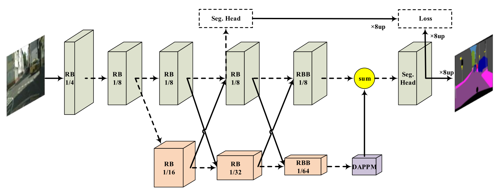

# DDRNet_paddle


## 1 简介
  
本项目基于paddlepaddle框架复现了DDRNet语义分割模型.

**论文：**
- [1] Changqian Yu, Jingbo Wang, Chao Peng, Changxin Gao, Gang Yu, and Nong Sang. [Deep Dual-resolution Networks for Real-time and Accurate Semantic Segmentation of Road Scenes](https://arxiv.org/abs/2101.06085)

**项目参考：**
- [https://github.com/ydhongHIT/DDRNet](https://github.com/ydhongHIT/DDRNet)

## 2 复现精度
>在CityScapes val数据集的测试效果如下表。


| NetWork  | steps |opt|image_size| batch_size |dataset|memory|card|  mIou  |                                             config                                              |                          weight                           |            log             |
|:--------:|:-----:| :---: |:--------:|:----------:| :---: | :---: | :---: |:------:|:-----------------------------------------------------------------------------------------------:|:---------------------------------------------------------:|:--------------------------:|
| DDRNet23 | 120K  |SGD|  1024x1024x512   |     12     |CityScapes|32G|4| 79.79% | [ddrnet23_cityscapes_1024x1024_120k.yml](configs/ddrnet/ddrnet23_cityscapes_1024x1024_120k.yml) | [link 提取码：z1da](https://pan.baidu.com/s/108xV62Mmn8wztX2gxKsHLQ ) | [log](log/trainer-log.txt) |

## 3 数据集
[CityScapes dataset](https://www.cityscapes-dataset.com/)

- 数据集大小:
    - 训练集: 2975
    - 验证集: 500

## 4 环境依赖
- 硬件: Tesla V100 * 4

- 框架:
    - PaddlePaddle == 2.2.2


## 快速开始

### 第一步：克隆本项目
```bash
# clone this repo
git clone https://github.com/justld/DDRNet_paddle.git
cd DDRNet_paddle
```

**安装第三方库**
```bash
pip install -r requirements.txt
```


### 第二步：训练模型
上方表格提供imagenet pretrained权重以及训练好的权重，如需加载预训练权重，需要修改config文件中的pretrain路径。  

单卡训练：
```bash
python train.py --config configs/ddrnet/ddrnet23_cityscapes_1024x1024_120k.yml  --do_eval --use_vdl --log_iter 100 --save_interval 4000 --save_dir output
```
多卡训练：
```bash
python -m paddle.distributed.launch train.py --config configs/ddrnet/ddrnet23_cityscapes_1024x1024_120k.yml  --do_eval --use_vdl --log_iter 100 --save_interval 1000 --save_dir output
```

### 第三步：测试
output目录下包含已经训练好的模型参数以及对应的日志文件。(权重文件在上方的表格中)
```bash
python val.py --config configs/ddrnet/ddrnet23_cityscapes_1024x1024_120k.yml --model_path {your_model_path}
```

### 第四步：tipc
在linux下，进入DDRNet_paddle文件夹，运行命令
```bash
bash test_tipc/prepare.sh ./test_tipc/configs/ddrnet/train_infer_python.txt 'lite_train_lite_infer'
bash test_tipc/test_train_inference_python.sh ./test_tipc/configs/ddrnet/train_infer_python.txt 'lite_train_lite_infer'
```

## 5 代码结构与说明
**代码结构**
```
├─benchmark  
├─configs  
├─deploy  
├─images  
├─configs  
├─slim  
├─images  
├─output  
├─paddleseg  
├─test_tipc  
│  export.py  
│  predict.py  
│  README.md  
│  README_CN.md  
│  requirements.txt  
│  setup.py  
│  train.py  
│  val.py  
```
**说明**
1、本项目在Aistudio平台，使用Tesla V100 * 4 脚本任务训练120K miou达到79.79%。  
2、本项目基于PaddleSeg开发。  

## 6 模型信息

相关信息:

| 信息 | 描述                                                                                                                                              |
| --- |-------------------------------------------------------------------------------------------------------------------------------------------------|
| 作者 | 郎督                                                                                                                                              |
| 日期 | 2022年4月                                                                                                                                         |
| 框架版本 | PaddlePaddle==2.2.2                                                                                                                             |
| 应用场景 | 语义分割                                                                                                                                            |
| 硬件支持 | GPU、CPU                                                                                                                                         |
| 在线体验 | [notebook](https://aistudio.baidu.com/aistudio/projectdetail/3755861?contributionType=1) |


